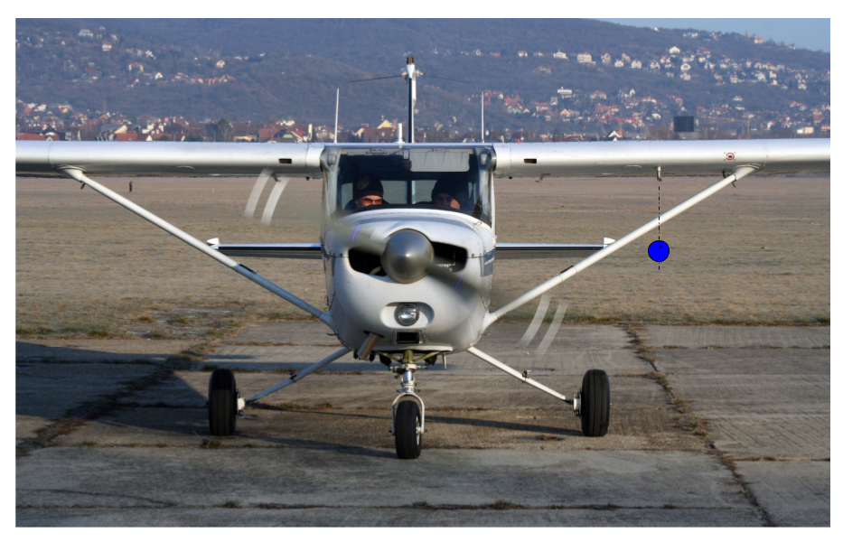
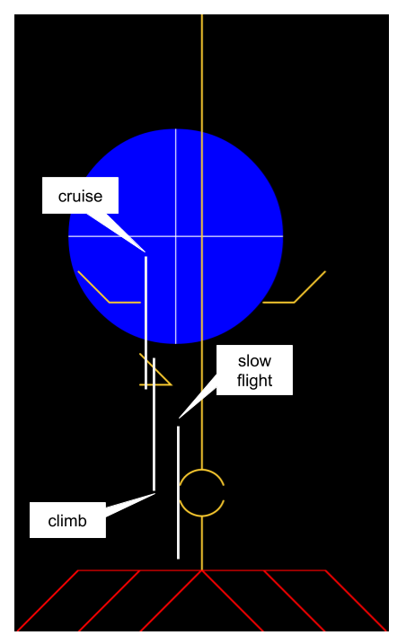

# Data from flight test

This was a flight test in a C172M.

The barometric pressure sensor was installed in the probe. Due to an
error of setup, the hoses to the yaw sensor were switched left/right
from their usual orientation.

The probe was mounted slightly below the strut and on a direct
vertical line downward from the Pitot tube, as illustrated below:

Total Hobbs time was 1.7 hours. We targeted a peak altitude of 11,500
feet. At peak altitude, we measured a pressure altitude of 11,300
feet, at 0 degrees C and 83 KIAS.

At no time, including peak altitude, did we observe the TAS "ring"
show up on the display. It is unclear if this is due to a bug in the
software or whether the algorithm that hides that ring unless the
TAS-IAS spread is large enough is too aggressive.

We planned to fly the software with the "beta bias" adjustment, but
again due to a failure of setup we did not have that version
installed. So instead we centered the inclinometer ball at different
flight conditions, and noted where in the display the ball was
situated. Our observation is below:

In post-processing, and based on the display settings, we can
determine the yaw variation between the different flight
conditions. The settings file is included. Beta max was set at 300
counts which equates to +/- 15 degrees full scale.
