# Description of probe calibration

## Probe design

The probe is a semi-spherial body with 6 holes in it, as follows.

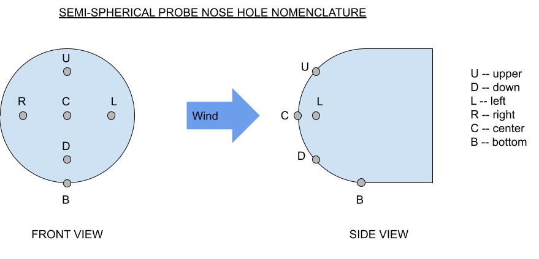

## Experiment design

We installed the above probe in a wind tunnel and acquired data at varying dynamic pressures, for a range of angles of sideslip and attack from -45 to +45 degrees. The data was more "dense" in certain areas, and we need to do more data collection. However, the data reduction procedure remains the same.

Our data consisted of the pressure at each hole, and tunnel dynamic pressure _q_ from a Pitot-static probe in the tunnel. Because of an error in experimentation, our reference pressures were not set to tunnel static, so we need to re-do our experiments. But our data so far should explain our procedure.

## Raw data

We plotted the pressure at each hole, divided by _q_, versus _alpha_ and _beta_. These normalized pressures (pressure divided by _q_) are _pressure coefficients_.

The Reynold's number _Re_ defines the ratio of viscous forces to momentum forces in a given flow. At a given _range_ of _Re_, the "shape" of the flow is the same, regardless of the dynamic pressure _q_. And further, the pressures in the flow field are multiples of _q_, where the multiplier is a _pressure coefficient_. We use that approximation, and the fact that a small airplane is in a fixed range of _Re_ throughout its flight envelope, to simplify our data.

The data showed asymmetry because of a strut that was installed as part of the design that stuck into one side of the flow field. We split the data in half and mirrored the part "away from" the strut to compensate. This will be fixed in our next experiment run.

### Pc / q (Center)

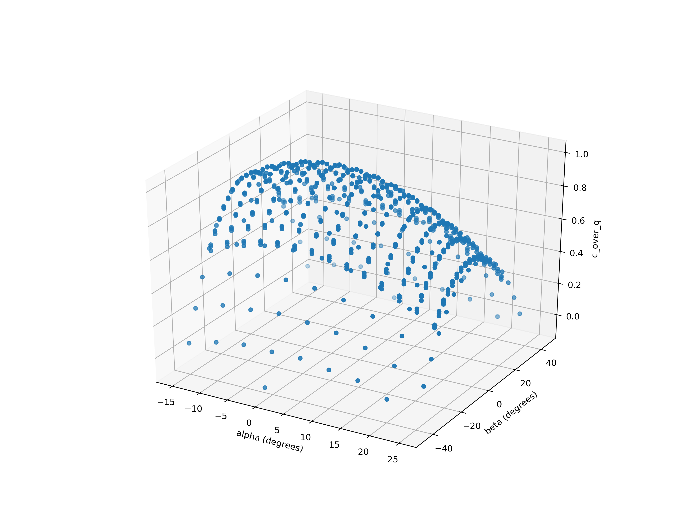

### Pu / q (Up)

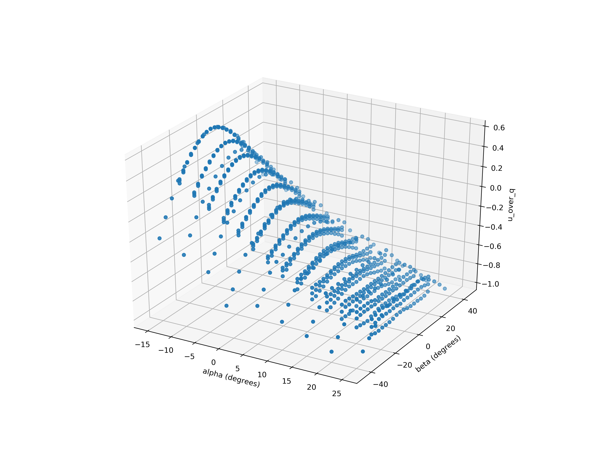

### Pd / q (Down)

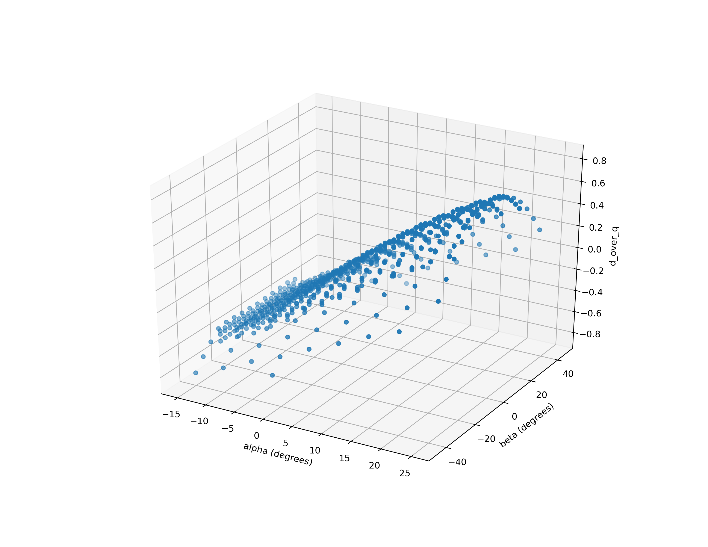

### Pl / q (Left)

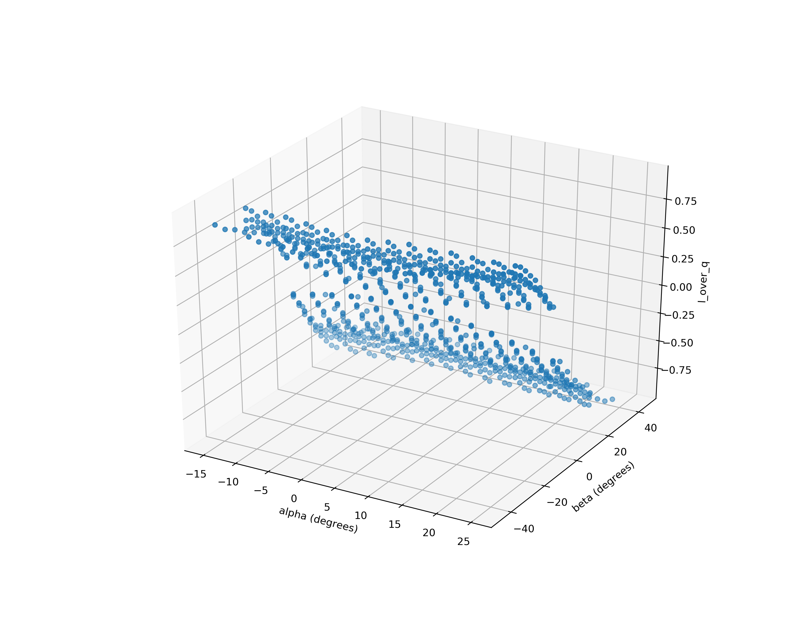

### Pr / q (Right)

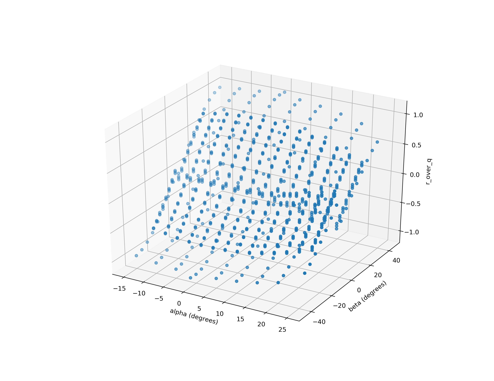

### Pb / q (Bottom)

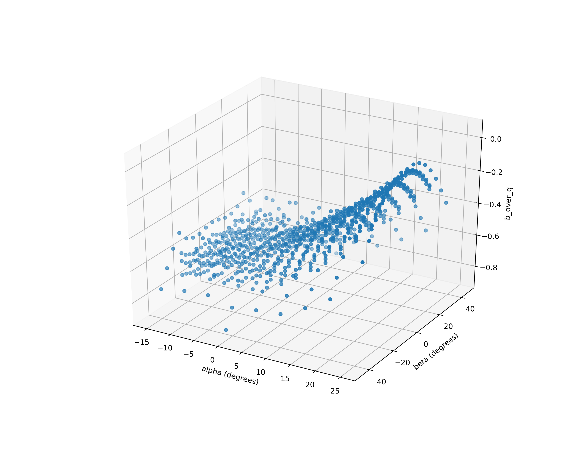

## Measurement strategy

We decided to _measure_ the following three pressure differences as our means of calculating _alpha_, _beta_, and _q_:

* dp0 = (Pc - Pb)
* dpA = (Pd - Pu)
* dpB = (Pr - Pl)

These are actual measurements in units of pressure. If we take the ratios, we now get non-dimensional values:

* (dpA / dp0)
* (dpB / dp0)

We can use these non-dimensional ratios as indices into calibration curves, and estimate _alpha_, _beta_, and _q_.

## Calibration curve derivation

From the experimental data, we can plot (dp0 / q), (dpA / q), and (dpB / q) versus _alpha_ and _beta_:

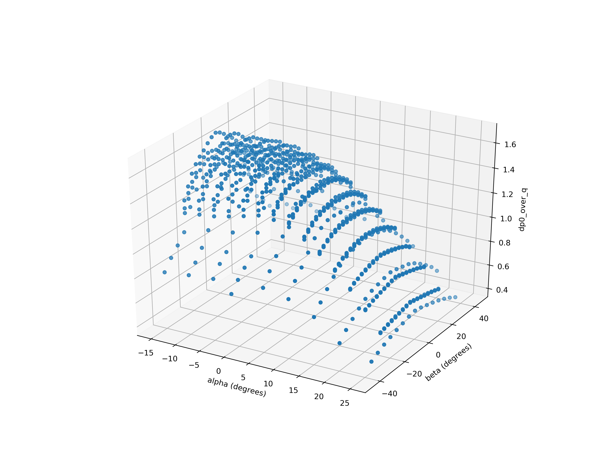
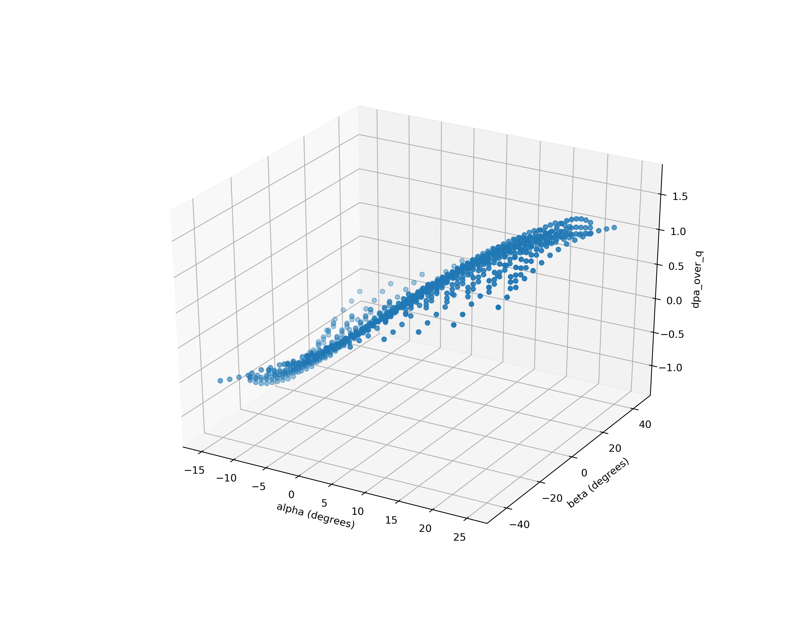
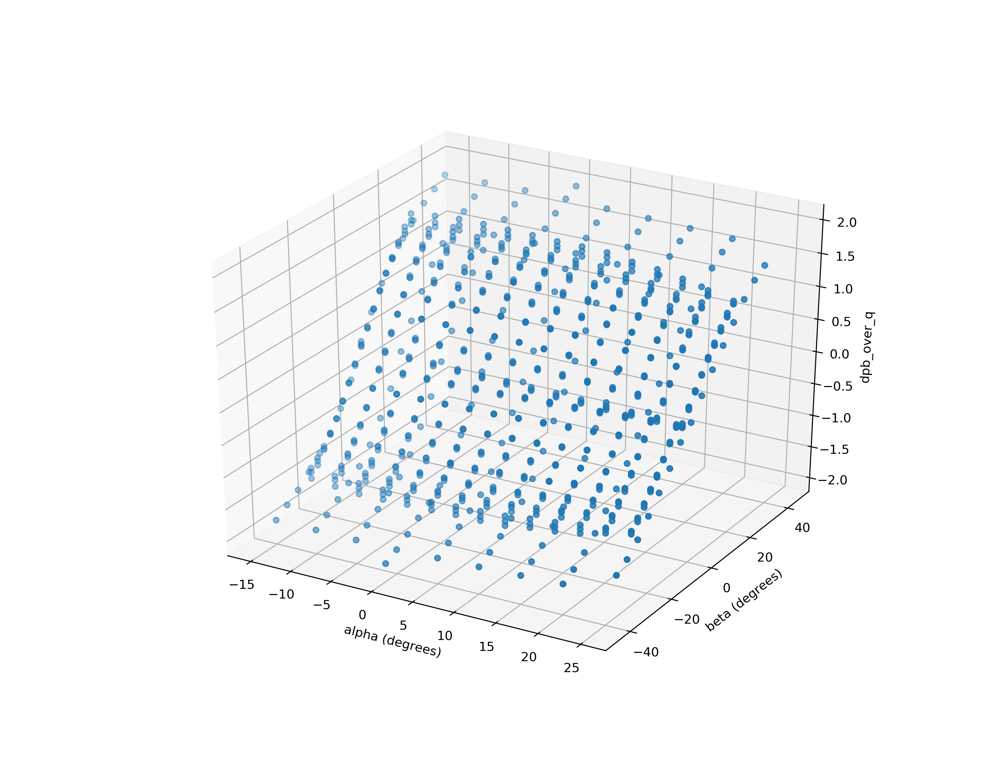

We can see that these pressure differences are in the range of +/- 2 times _q_. If we choose a pressure sensor with a range of +/- 1 psi, then we expect to handle _q_ ranging from 0 to 0.5 psi. This corresponds to an indicated airspeed of about 150 kias. In practice, since we will be flying at low _alpha_ and _beta_ when we are going fast, our actual practical aircraft IAS range is going to be larger than this.

Notice how we do not need a source of static pressure since we _subtract_ pressures from one another, and we do not need an independent source of _q_ since we _divide_ pressures by one another.

We can now generate curve fits for _alpha_ and _beta_ as functions of (dpA / dp0) and (dpB / dp0) as follows:

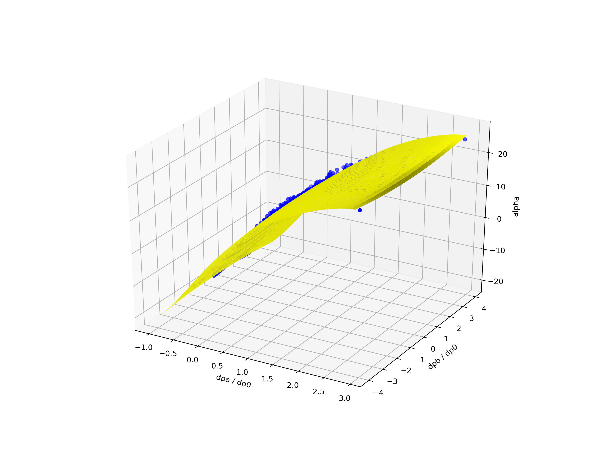

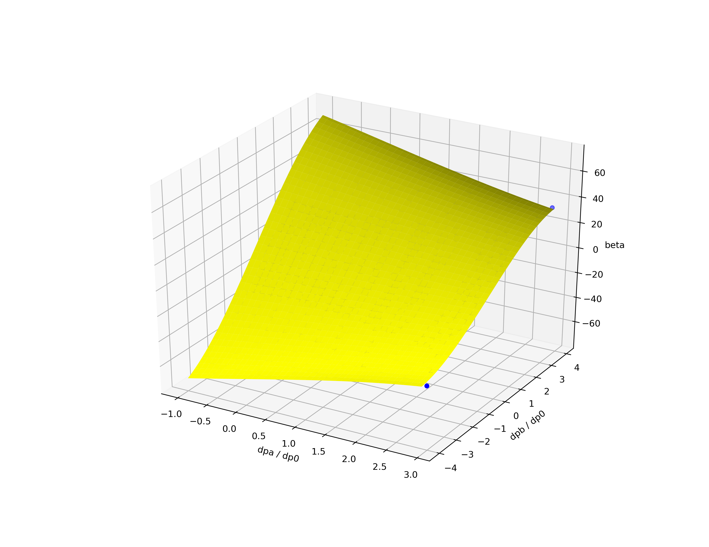

We can also generate a fit for (q / dp0) so that we can use our measured value of dp0 (an actual dimensional pressure value) to estimate _q_:

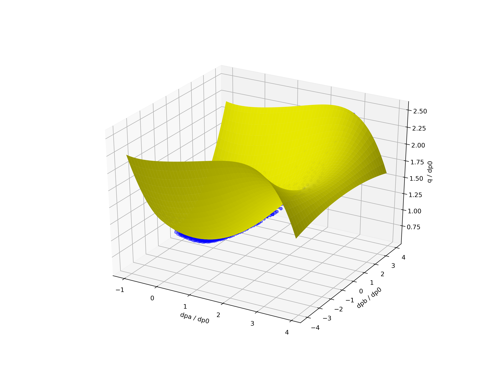
