# Probe Build Instructions

## 0  Introduction

The probe is shipped to you as a series of parts, and a few tools. You will need basic additional tools including:

* Screwdrivers
* An electric drill
* A hobby knife ("X-Acto knife")
* Transparent tape ("Scotch tape")
* Masking tape (optional)
* Cyanoacrylate glue ("Super glue")
* Fine-tipped marker pen ("Sharpie")
* Ruler, preferably marked in inches

The level of skill required to complete this kit, and the techniques involved, should be equivalent to those required to finish (but not paint) a simple, plastic, non-flying, scale model airplane.

The techniques discussed here are ones we have used ourselves and found to work well. The tools are commonly available to consumers. However, these instructions are only suggestions. You are ultimately responsible for any work you do. Always use eye protection, avoid toxic fumes and hazardous materials, and use all protections and cautions applicable to the tools you are using, whether supplied with the kit of provided by you. If you are unsure, please consult someone experienced in the range of tools and techniques you wish to employ.

The kit contents look like the following. (Some items in your kit may differ slightly from the picture.)

<a href="./images/kit-full.jpg">
  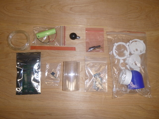
</a>

Your probe, when completed, should look like this. Good luck!

TODO(ihab): Picture of real probe instead of diagram.

<a href="./images/probe-schematic.png">
  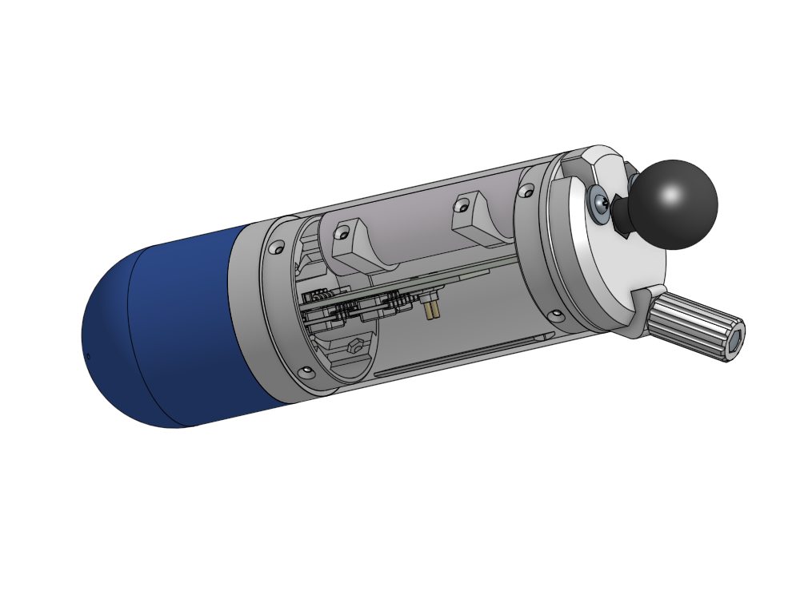
</a>

## 1  General techniques

### 1.1  Drilling holes

You are supplied with three drill bits -- 1/16", 5/64", and 3/32" in diameter. In some cases, you are asked to drill to a given depth. One way to create a simple drill depth marker is to lay your drill bit next to a ruler, and apply a piece of tape to it at the place you want to stop the drilling.

 Then pick up the drill bit and wrap the tape around it.
 
<a href="./images/tech-drillstop-2.jpg">
  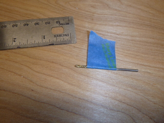
</a>

### 1.2  Cleaning up 3D printed parts

3D printed parts are supplied with "supports" (i.e., extra plastic printed to maintain the shape of the part) still included. In many cases, the holes are filled with support material which is loosely attached to the part. Chip away the supports using a small flat-bladed screwdriver or other suitable tool, but do not use any fragile tool that might snap off and injure you or others. Use eye protection when chipping or snapping anything off.

<a href="./images/tech-clearing-hole.jpg">
  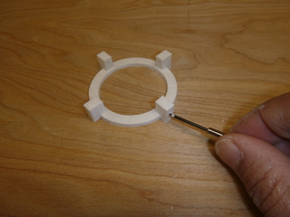
</a>

Many 3D printed parts will have a "rim" created during the printing process, at the point where the part contacts the heated 3D printer bed. You may ignore this in some places, but where the part's edge is exposed, you will need to remove it. Remove only enough material to square off the edge; do not round it over. A good technique is to draw the part across a piece of sandpaper. You may also wrap pieces of sandpaper around a popsicle stick, a non-sharp butter knife, a pencil, or a piece of dowel, to create a sanding instrument to get into tight places.

<a href="./images/tech-sanding-edge.jpg">
  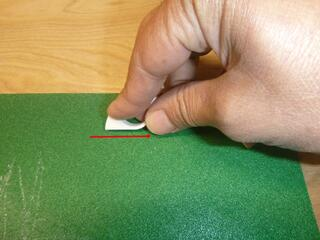
</a>

### 1.3  Inserting nuts into 3D printed parts

At various points in the build, you will need to press fit a hex nut into a hexagonal pocket in a 3D printed part, providing a high-strength place for a machine screw to attach. The pockets are designed to be a tight fit. We recommend you insert a screw into the screw hole frome the other side, use it to "grab" the nut, and tighten the screw to pull the nut into its pocket.

## 2  Preparing plastic parts

The following instructions discuss the cleanup and preparation of particularly important parts.

### 2.1  Rear cover

Remove supports from the power switch cutout.

<a href="./images/3dp-rear-cover-1.jpg">
  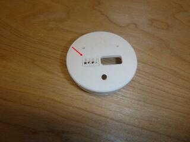
</a>

Clear out the holes and hexagonal pockets (4 places).

<a href="./images/3dp-rear-cover-2.jpg">
  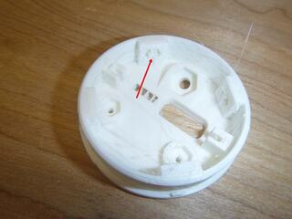
</a>

### 2.2  Mounting plate

Clean up the rim all around the part, paying special attention to the rectangular slot and the two oval slots. You may need to very carefully use a hobby knife to cut away the rim in the corners of the slots. Be careful not to take too much material away and deform the shape of the part.

<a href="./images/3dp-mounting-plate.jpg">
  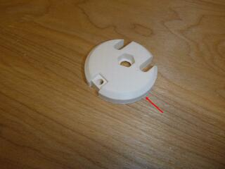
</a>

### 2.3  Mounting plate extension

Clean up the rim and remove supports from the hole

<a href="./images/3dp-mounting-plate-extension.jpg">
  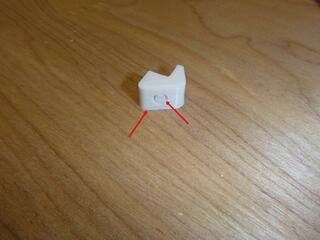
</a>

### 2.4  Front cover

Clean up the outside rim. Remove supports from the banjo-shaped section. Clean up the rim of the banjo-shaped section.

<a href="./images/3dp-front-cover-1.jpg">
  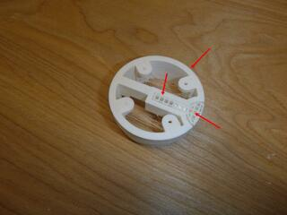
</a>

Remove supports from the holes and hexagonal pockets (4 places). Remove supports from the countersunk holes and ensure they are clear of debris (4 places).

<a href="./images/3dp-front-cover-2.jpg">
  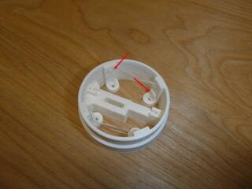
</a>

### 2.5  Battery support

Clean up the rim. Drill ⌀ 5/64" x 3/8" deep (2 places). Make 2 parts.

<a href="./images/3dp-battery-support.jpg">
  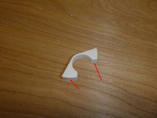
</a>

### 2.6  Barometer shroud

Clean up the rim. *Note 1:* Drill ⌀ 5/64" thru (2 places). *Note 2:* Drill ⌀ 1/16" thru (2 places).

<a href="./images/3dp-barometer-shroud-1.jpg">
  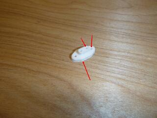
</a>

Remove supports and stray bits of plastic filament from cavity.

<a href="./images/3dp-barometer-shroud-2.jpg">
  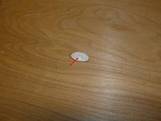
</a>

### 2.7  Nose ball

Clean up the rim. Remove supports on the side, if any.

<a href="./images/3dp-nose-ball-1.jpg">
  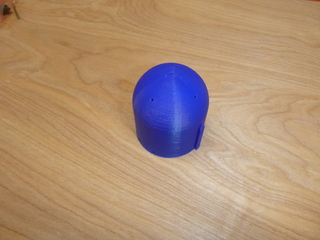
</a>

Remove supports from the circular cutout on the rim and from the inside cavity. You can grab the large chunk of supports with pliers as shown, and pull them out, then clean off the remaining bits in the interior. Drill ⌀ 5/64" x 1/2" deep (4 places).

<a href="./images/3dp-nose-ball-2.jpg">
  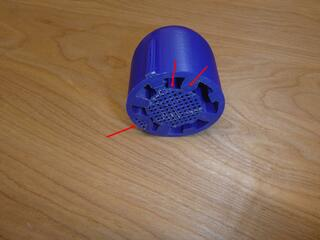
</a>

<a href="./images/3dp-nose-ball-3.jpg">
  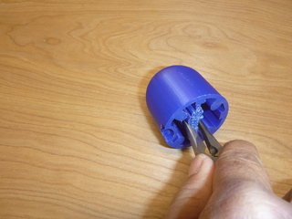
</a>

With the nose resting firmly on a flat surface, carefully drill out the holes in the nose to ⌀ 1/16" thru (6 places). Ensure your drill is carefully aligned with the holes so as not to deform their shapes. Observe how the holes are set at intervals of 45 degrees and 90 degrees.

<a href="./images/3dp-nose-ball-4.jpg">
  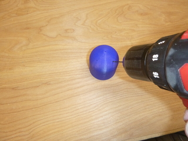
</a>

## 3  Preparing the body tube

### 3.1  Finishing

Place sandpaper on a flat surface, press down the tube firmly, and flatten its edge using a circular motion.

<a href="./images/tube-finish-1.jpg">
  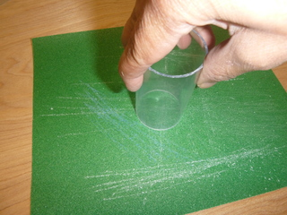
</a>

Run the sandpaper around the outside corners on each end to very lightly remove burrs, but be careful not to round the edges over.

### 3.2  Centerline marking

Place a strip of transparent tape along the tube, lengthwise.

<a href="./images/tube-mark-1.jpg">
  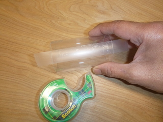
</a>

Firmly press the tube against the edge of a book or other raised edge parallel to the work table. Using a fine tipped marker, against the raised surface, draw a single straight line over the tape.

<a href="./images/tube-mark-2.jpg">
  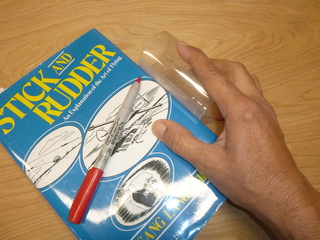
</a>

<a href="./images/tube-mark-3.jpg">
  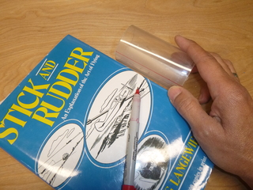
</a>

In its flight orientation, this line will serve as the bottom centerline of the entire probe. Be careful not to smudge this line. We recommend you keep the tape on until the very last moment.

### 3.3  Hole drilling

Using the supplied tool as shown, align the notch on the tool with the centerline you drew, and press down firmly onto the tube at the edge of the work table. Drill through the tool into the tube, ⌀ 3/32" thru (4 places). Flip the tube over and repeat.

<a href="./images/tube-drill-1.jpg">
  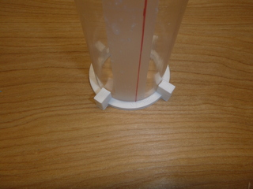
</a>

<a href="./images/tube-drill-2.jpg">
  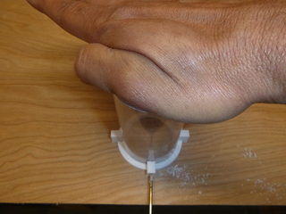
</a>

Using a ruler, make a mark 7/8" from each end on the centerline.

<a href="./images/tube-drill-3.jpg">
  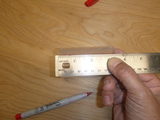
</a>

Slip the tool shown onto the tube, aligning the notch with the centerline you drew, up to the point where the tool is just "inboard" of the mark you made on the centerline.

<a href="./images/tube-drill-4.jpg">
  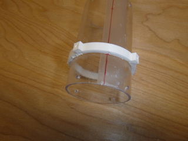
</a>

Drill through the tool into the tube, ⌀ 3/32" thru (2 places), in the 2 spots on the side of the tube **opposite the centerline only**. In the illustration below, note the position of the centerline and the positions of the 2 holes to be drilled. Repeat using the mark on the centerline on the opposite end of the tube.

<a href="./images/tube-drill-5.jpg">
  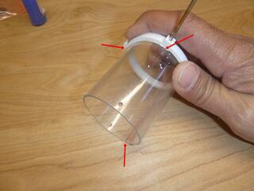
</a>

If there are any burrs in the insides of the holes, knock these off without enlarging the holes.

<a href="./images/tube-drill-6.jpg">
  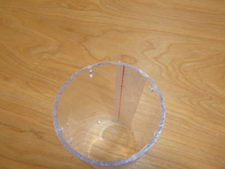
</a>

Countersink the holes in the tube (12 places) using the supplied tool, such that one of the threaded #2 screws supplied with the kit fits just flush or slightly proud of the surface of the tube. Do not over-do it. We suggest you countersink one hole a little at a time, stopping and checking with the screw. When you reach the depth you want, remember the appearance of the resulting countersink and duplicate it in the other holes, checking back frequently to remind yourself.

<a href="./images/tube-drill-7.jpg">
  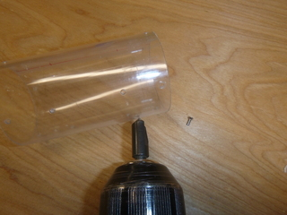
</a>

## 4  Attaching pneumatic hose nipples

### 4.1  Make nipples from brass tube

Chuck the supplied 1/16" diameter brass tube in your electric drill, and locate the 3D printed tool as shown:

<a href="./images/nipple-make-1.jpg">
  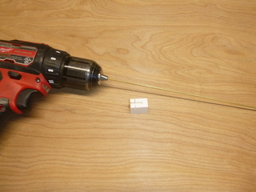
</a>

On a secure, level surface, place the tube in the V groove of the tool until it bottoms out, and press down on it with a hobby knife. Rotate the electric drill carefully while maintaining control of the hobby knife. We recommend rotating the drill so that the upper surface of the tube moves away from you. Continue until the hobby knife cuts through the tube. Repeat this to make 8 short sections of brass tube.

<a href="./images/nipple-make-2.jpg">
  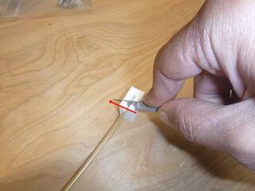
</a>

For each end of each section of tube, draw it over the sandpaper while rotating it, so as to remove burrs in the edge **and round over the edge**.

<a href="./images/nipple-make-3.jpg">
  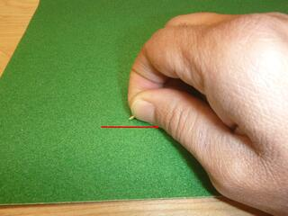
</a>

You should end up with 8 brass nipples, the same length, with burr-free, slightly rounded-over ends.

<a href="./images/nipple-make-4.jpg">
  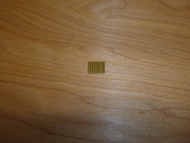
</a>

### 4.2  Assemble nipples to ball nose

For each of the 6 holes in the ball nose, insert one of the brass nipples from the outside and press it in. It should slide in with just a little bit of pressure. Push it in, using the supplied 1/16" drill bit if necessary, until it is just below the surface when viewed from the outside of the ball nose. Repeat for all the holes.

<a href="./images/nipple-ball-nose-3.jpg">
  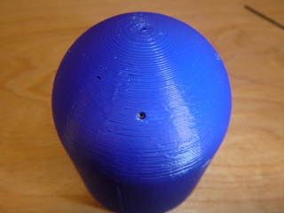
</a>

The nipples should protrude into the inside of the ball nose as shown. From the inside, place a small drop of CA glue at the junction of each nipple and the plastic. Set aside to dry.

<a href="./images/nipple-ball-nose-4.jpg">
  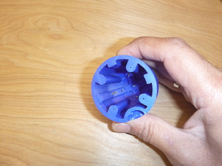
</a>

### 4.3  Assemble nipples to barometer shroud

For each of the 2 central holes in the barometer shroud, insert the remaining 2 brass nipples and press in. They should almost reach the cavity in the barometer shroud, but should not protrude into it. From the outside, place a small drop of CA glue at the junction of each nipple and the plastic. Set aside to dry.

<a href="./images/nipple-baro-shroud-1.jpg">
  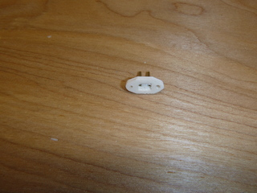
</a>

<a href="./images/nipple-baro-shroud-2.jpg">
  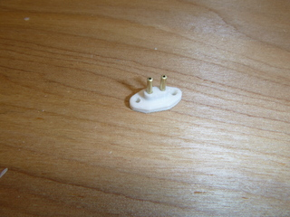
</a>

## 5  Building the rear assembly

TODO(ihab): 7/64" drill rear part or make hole bigger
TODO(ihab): Make the knob hole bigger 

Press the two #4 nuts into the pockets of the rear cover, pulling them into place with their matching screws.

<a href="./images/rear-assy-1.jpg">
  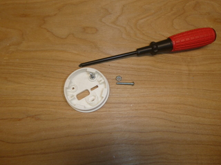
</a>

Press all four #2 nuts into their pockets in the rear cover, also pulling them into place with their matching screws.

<a href="./images/rear-assy-2.jpg">
  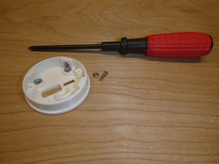
</a>

Insert the 2" long #8 hex head screw into its matching knob, until its head is contacting the pocket in the knob and aligned with it.

<a href="./images/rear-assy-3.jpg">
  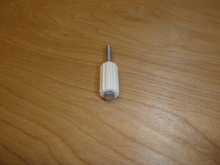
</a>

Thread the #8 hex nut onto the other side of the knob, and tighten it to draw the screw head into its pocket in the knob. Then remove the nut and set aside.

<a href="./images/rear-assy-4.jpg">
  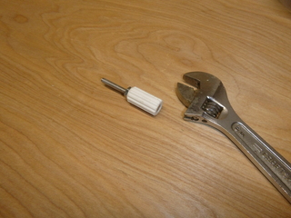
</a>

Find the mounting plate and mounting plate extension and ensure they fit together as in the pictures below. Apply a drop of CA glue to their mating surfaces and, **working quickly**, assemble them, pressing down on a table to secure them together. Study and rehearse their alignment carefully so as not to assemble them in the wrong orientation.

<a href="./images/rear-assy-5.jpg">
  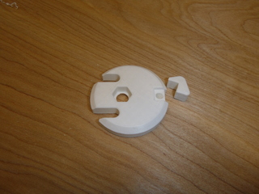
</a>

<a href="./images/rear-assy-6.jpg">
  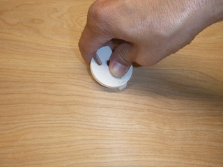
</a>

<a href="./images/rear-assy-7.jpg">
  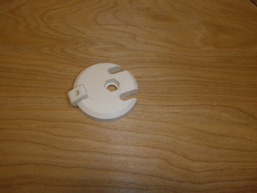
</a>

Place the mounting plate and rear cover together as shown and thread the #8 screw with its knob into the aligned holes. Use the #8 screw to pull the supplied #8 hex nut into its pocket.

<a href="./images/rear-assy-8.jpg">
  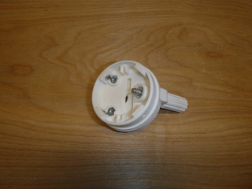
</a>

Put a few drops of CA glue **carefully** on the edge of the #8 hex nut, without getting any glue on the threads. Set aside to dry.

Assemble the two #4 screws, the supplied plastic spacers, and the supplied washers, to the rear cover as shown. Tighten the screws gently.

<a href="./images/rear-assy-10.jpg">
  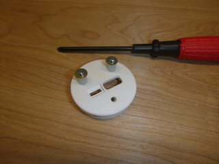
</a>

Assemble the mounting plate and the rear cover as shown, and slide them together. Adjust the two #4 screws until the two parts fit together securely, but do not require excessive force to push in.

<a href="./images/rear-assy-11.jpg">
  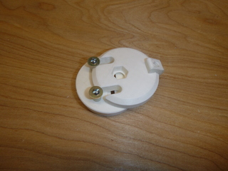
</a>

<a href="./images/rear-assy-12.jpg">
  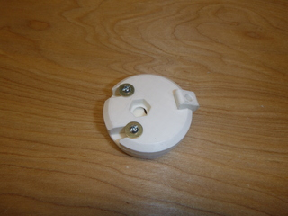
</a>

Place a drop of CA glue on the thread of each of the #4 screws where it enters the nut, to fix its position.

<a href="./images/rear-assy-13.jpg">
  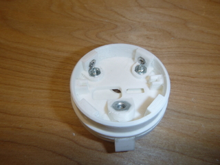
</a>

Secure the RAM ball to the mounting plate using the supplied 1/4"-20 flat head screw, and hand tighten until the hexagonal portion of the RAM ball meets the hexagonal pocket in proper alignment.

<a href="./images/rear-assy-15.jpg">
  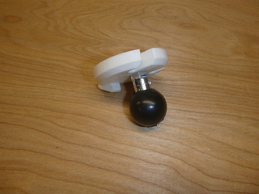
</a>

Tighten the 1/4"-20 screw until the hexagonal portion of the RAM ball is fully seated inside the mounting plage.

